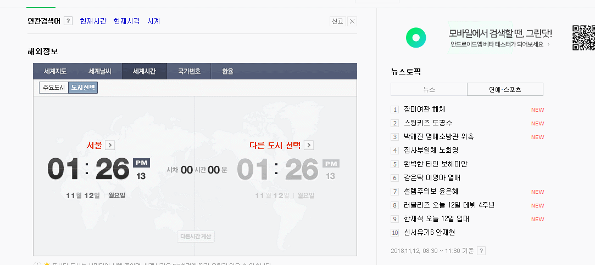

# 댓글 게시판(reply Bulletin Board System) - 개인 프로젝트 

## 목적
- 신입 웹 개발자의 기본소양
- 어떠한 웹이던지 게시판은 필수요소
- 반복된 연습으로 빠르고 최적화된 게시판 생성을 목표로함

----------------------------------------------------------------------------

## 개발환경
> Front-End
- Bootstrap 3
- Jquery 3  

> Back-End
- Spring 3.1
- JDK 1.7
- Mysql 5.7 
- Mybatis 3.4
- Tomcat 7
- Maven 2.9  

----------------------------------------------------------------------------

## 제작기간 - 2018/10/17 ~ 2018/11/06 ( 작업 기간: 15일, 주말 6일 제외 )    
> 1주차 (10/17 ~ 10/23), View 페이지 및 DB 모델링   
- 10/17 개발환경 설정 및 프로젝트 주제 설정  
- 10/18 Bootsrap3를 이용해 HTML View 페이지 설계 및 생성  
- 10/19 Mysql DB Model 설계 및 생성  
- 10/22 View (index, login, sign, view, writeForm, updateForm) 완성  
- 10/23 View 반복코드를 줄이고, 각종 유효성 검사 javascript로 적용  

> 2주차 (10/24 ~ 10/30), spring MVC 디자인 패턴 적용 및 게시판 기본 기능 완성     
- 10/24 MVC 디자인 패턴을 고려 한 프로젝트 패키지 설계 및 view 페이지 jsp로 변환    
- 10/25 회원가입 기능 구현  
- 10/26 로그인 및 게시판 view 기능 및 페이징 구현  
- 10/29 게시판 쓰기, 수정, 삭제 구현  
- 10/30 회원가입 아이디 중복체크, 이메일 인증 구현  

> 3주차 (10/31 ~ 11/06), 댓글, 검색, 추천, 조회수 등 세부 기능 구현 및 마무리  
- 10/31 게시판 CRUD 및 페이징 기능을 재사용 하여 댓글 CRUD 구현   
- 11/01 추천 및 조회수 기능 구현     
- 11/02 검색 기능 구현   
- 11/05 구현된 기능들 보완 및 코드 재정리  
- 11/06 마무리

----------------------------------------------------------------------------
## jboard 패키지 구조
  

----------------------------------------------------------------------------
## jbaord 데이터베이스 모델링
 

----------------------------------------------------------------------------
## Front-End 주요 기능
> bootstrap3로 View 페이지 설계 및 생성
- 회원가입 및 로그인시 유효성 검사를 css 클래스 추가 및 제거로 가시적으로 표현  
~~~c
// 키 입력시 유효성 검사 예시
// 마우스가 focus된 상태에서 4자리 이상 키 입력시 has-success 클래스 추가 (bootstrap3)
$("#id").focus(function () {
    if ($("#id").val() == 0) {
        $("#idInputGroup").addClass("has-error");
    }
    $("#id").keyup(function () {
        if ($("#id").val().length >= 4) {
            $("#idInputGroup").removeClass("has-error");
            $("#idInputGroup").addClass("has-success");
            $("#idDupCheck").removeClass("disabled");
        } else {
            $("#idInputGroup").removeClass("has-success");
            $("#idInputGroup").addClass("has-error");
            $("#idDupCheck").addClass("disabled");
        }
    });
});
~~~
  

- 인증 메일 전송시 애니매이션 구현
~~~c
var width = 1;
// setInterval 반복 실행 함수
// 60 = 0.06초당 1번
// 1부터 100까지 총 100번 = 0.06 * 100 = 6초
var id = setInterval(progress, 60);

function progress() {
    if (width >= 100) {
        // 반복 종료
        clearInterval(id);
        $("#progressBar").removeClass("progress-bar");
        $("#progressBar").addClass("progress-bar-success");
        $("#progressBar").text("인증 메일이 전송 완료되었습니다");
    } else {
        width++;
        $("#progressBar").css("width", width + '%');
        $("#progressBar").text(width + '%');
    }
}
~~~
  

> 게시판 글쓰기, 글수정시 네이버 에디터2 적용  
~~~c
// 네이버 에디터2
var oEditors = [];
nhn.husky.EZCreator.createInIFrame({
    oAppRef : oEditors,
    // elPlaceHoder와 <textarea> id값과 일치해야 적용된다
    elPlaceHolder : "content",
    sSkinURI : "../resources/js/naver_smart_editor2/SmartEditor2Skin.html",
    fCreator : "createSEditor2",
    htParams : {
        // 툴바 사용 여부 (true:사용/ false:사용하지 않음)
        bUseToolbar : true,
        // 입력창 크기 조절바 사용 여부 (true:사용/ false:사용하지 않음)
        bUseVerticalResizer : false,
        // 모드 탭(Editor | HTML | TEXT) 사용 여부 (true:사용/ false:사용하지 않음)
        bUseModeChanger : false,
        // "저장하지 않고 나가시겠습니까" 메시지 스킵을 위한 기능
        fOnBeforeUnload : function() {
        }
    },
    fOnAppLoad : function() {
    }
});
~~~
  

> jstl "c"를 이용하여 데이터 뿌리기  

~~~c
<%@ taglib prefix="c" uri="http://java.sun.com/jsp/jstl/core"%>
<%@ taglib prefix="fmt" uri="http://java.sun.com/jsp/jstl/fmt"%>
// <c:forEach> 반복 태그를 이용해 list에 담긴 내용을 보여준다
<c:forEach items="${list}" var="list">
    <tr>
        <td>${list.b_num}</td>
        <td>
            <a href="board/view${pageMaker.makeQuery(pageMaker.pc.page)}&b_num=${list.b_num}">${list.b_title}</a>
            <c:if test="${list.b_reply_count > 0}">
                [${list.b_reply_count}]
            </c:if>
        </td>
        <td>${list.b_writer}</td>
        <td>
            <fmt:formatDate pattern="yyyy-MM-dd" value="${list.b_reg_date}" />
        </td>
        <td>${list.b_hit}</td>
        <td>${list.b_recommend}</td>
    </tr>
</c:forEach>
~~~

> include를 이용하여 헤더 및 푸터 반복코드 제거 
~~~c
<!-- header include -->
<jsp:include page="include/header.jsp" />
...
<!-- footer include -->
<jsp:include page="include/footer.jsp" />
~~~
----------------------------------------------------------------------------

## Back-End 주요 기능
> Common Class  
- InterceptorLogin 로그인 인터셉터 
~~~c
// servlet-context.xml
// 로그인 인터셉터 객체 생성 
<beans:bean id="InterceptorLogin" class="com.japp.jboard.common.interceptor.InterceptorLogin" />

// 로그인 인터셉터 설정
// 특정 URI 요청시 컨트롤러로 가는 요청을 가로채는 역할을 한다 
<interceptors>
    <interceptor>
        // 맵핑 경로 요청이 수행되기 전에 로그인 인터셉터를 먼저 수행
        <mapping path="/board/writeForm" />
        <mapping path="/board/updateForm" />
        <mapping path="/board/deleteForm" />
        <mapping path="/board/recommend" />
        <beans:ref bean="InterceptorLogin" />
    </interceptor>
</interceptors>
~~~
~~~c
// InterCeptorLogin.java
// preHandle(): 컨트롤러보다 먼저 수행되는 메서드
@Override
public boolean preHandle(HttpServletRequest request, HttpServletResponse response, Object handler) throws Exception {
    // session 객체를 가져온다
    HttpSession session = request.getSession();
    Object obj = session.getAttribute("login_session");

    if (obj == null) {
        // 로그인이 되어 있지 않은 상태, 즉 login_session 값이 null인 경우
        JOptionPane.showMessageDialog(null, "로그인이 필요합니다.\n로그인 페이지로 이동합니다");
        // /board/... 에서 인터셉트 하기 때문에 "../" 상위 경로로 나간 후 login폼으로 이동
        response.sendRedirect("../loginForm");
        // 더 이상 컨트롤러 요청으로 가지 않도록 false 반환
        // 로그인이 안된 상태에서 기능 요청으로 보내지 않기 위함
        return false;
    }

    // preHandle()의 return은 컨트롤러 요청이 URI로 가도 되냐 안되냐를 허가하는 의미
    // 따라서 true인 경우 컨트롤러 URI로 가게 된다
    return true;
}
~~~
- MailAuthKeyGenerator 인증키 생성기  
~~~c
// MailAuthKeyGenerator.java
// 문자열 길이
private int certCharLength = 24;
// 포함되는 문자들
private final char[] characterTable = { 'A', 'B', 'C', 'D', 'E', 'F', 'G', 'H', 'I', 'J', 'K', 'L', 'M', 'N', 'O', 'P', 'Q', 'R', 'S',
        'T', 'U', 'V', 'W', 'X', 'Y', 'Z', '1', '2', '3', '4', '5', '6', '7', '8', '9', '0' };

// java 랜덤 함수와 for문을 이용하여 24자리 랜덤 문자열 생성 후 반환
public String excuteGenerate() {
    Random random = new Random(System.currentTimeMillis());
    int tablelength = characterTable.length;
    StringBuffer buf = new StringBuffer();

    for (int i = 0; i < certCharLength; i++) {
        buf.append(characterTable[random.nextInt(tablelength)]);
    }

    return buf.toString();
}
~~~
- MailHandler 메일 전송  
~~~c
// root-context.xml
// 메일 보내기
<bean id="mailSender" class="org.springframework.mail.javamail.JavaMailSenderImpl">
    <property name="host" value="smtp.gmail.com" />
    <property name="port" value="587" />
    // 주의! 개인정보
    <property name="username" value="자신의 Gmail 아이디" />
    <property name="password" value="Gmail 비밀번호" />
    // 설정
    <property name="javaMailProperties">
        <props>
            <prop key="mail.transport.protocol">smtp</prop>
            <prop key="mail.smtp.auth">true</prop>
            <prop key="mail.smtp.starttls.enable">true</prop>
            <prop key="mail.debug">true</prop>
        </props>
    </property>
</bean>
~~~
~~~c
// MailHandler.java
private JavaMailSender mailSender;
private MimeMessage message;
private MimeMessageHelper messageHelper;

public MailHandler(JavaMailSender mailSender) throws MessagingException {
    this.mailSender = mailSender;
    message = this.mailSender.createMimeMessage();
    messageHelper = new MimeMessageHelper(message, true, "UTF-8");
}
// 이메일 제목
public void setSubject(String subject) throws MessagingException {
    messageHelper.setSubject(subject);
}
// 이메일 내용
public void setText(String htmlContent) throws MessagingException {
    messageHelper.setText(htmlContent, true);
}
// 보내는 사람 이메일
public void setFrom(String email, String name) throws UnsupportedEncodingException, MessagingException {
    messageHelper.setFrom(email, name);
}
// 받는 사람 이메일
public void setTo(String email) throws MessagingException {
    messageHelper.setTo(email);
}
public void addInline(String contentId, DataSource dataSource) throws MessagingException {
    messageHelper.addInline(contentId, dataSource);
}
public void send() {
    try {
        mailSender.send(message);
    } catch (Exception e) {
        e.printStackTrace();
    }
}
~~~

- PageCriteria 게시판 페이징 기준   
~~~c
// PageCriteria.java
/*
    standard vs criterion(복수형, criteria)
    standard 대부분의 사람들이 생각하는 '기준'
    criterion 내가 사용하는 '기준'
*/
// 현재 페이지를 나타낼 변수
private int page;
// 페이지당 표시할 게시글의 수 
private int perPageNum; 
// limit구문에서 시작 부분에 필요한 값을 반환(Mybatis)
public int getPageStart() {
    return (this.page - 1) * this.perPageNum;
}
// 최초 default 생성자
// 기본 객체 생성시 초기값을 지정한다(1페이지에 10개)
public PageCriteria() {
    this.page = 1; // 사용자가 정의하지 않으면 1
    this.perPageNum = 10; // 페이지당 10개씩 출력
}
// getter, setter
public int getPage() {
    return page;
}
public void setPage(int page) {
    // 시작 페이지는 1로 설정
    if (page <= 0) {
        this.page = 1;
    } else {
        this.page = page;
    }

}
public int getPerPageNum() {
    return perPageNum;
}
// 페이지당 설정, 100이상 넘어갈 수 없다
public void setPerPageNum(int perPageNum) {
    if (perPageNum <= 0 || perPageNum > 100) {
        this.perPageNum = 10;
    } else {
        this.perPageNum = perPageNum;
    }
}
~~~
- PageMaker 게시판 페이징  
~~~c
// PageMaker.java
private PageCriteria pc; // page, perPageNum을 가지고 있다
private int totalCount; // 전체 게시글의 수
private int startPage; // 게시글 번호에 따라 보여지는 페이지의 시작 번호
private int endPage; // 게시글 번호에 따라 보여지는 페이지의 마지막 번호
private boolean prev; // 이전 버튼을 누를 수 있는 경우 분류를 위한 변수
private boolean next; // 다음 버튼을 누를 수 있는 경우 분류를 위한 변수
private int displayPageNum = 10; // 화면 하단에 보여지는 페이지의 개수
private int tempEndPage;

public void setTotalCount(int totalCount) {
    this.totalCount = totalCount;
    calcData(); // 전체 필드 변수들 세팅
                // 전체 게시글 수의 setter가 호출될 때 전체 세팅되도록 함
}
// 전체 필드 변수 값들을 계산하는 메서드
private void calcData() {
    endPage = (int) (Math.ceil(pc.getPage() / (double) displayPageNum) * displayPageNum);
    startPage = (endPage - displayPageNum) + 1;
    int tempEndPage = (int) (Math.ceil(totalCount / (double) pc.getPerPageNum()));
    this.tempEndPage = tempEndPage;

    if (endPage > tempEndPage) {
        endPage = tempEndPage;
    }

    // 1페이지인 경우 이전(false)
    prev = startPage == 1 ? false : true;
    next = endPage * pc.getPerPageNum() >= totalCount ? false : true;
}
// .jsp에서 페이징 처리를 할 때
// 페이지에 따라 a태그를 이용해서 href 페이지를 띄우는 요청을 걸 때
// 반복되는 작업을 처리하기위해 스프링에서 지원하는 "UriComppent"를 사용한다
public String makeQuery(int page) {
    UriComponents uriComponents = UriComponentsBuilder.newInstance().queryParam("page", page)
            .queryParam("perPageNum", pc.getPerPageNum()).build();

    return uriComponents.toUriString();
}
// getter, setter, toString 생략
~~~
- ReplyPageCriteria 댓글 페이징 기준   
- ReplyPageMaker 댓글 페이징  

## 메서드 처리과정
`요청 > 컨트롤러 > 서비스 > 서비스 구현 > DAO > DAO 구현 > Mybatis > DB > 컨트롤러 - DB 반환`

> User Method  
  
## idDupCheck() 아이디 중복확인   
~~~c
// 요청 처리과정 
// signValidation -> UserController -> UserService -> UserServiceImpl -> UserDao -> UserDaoImpl -> user_mapper(Mybatis, DB접속) -> UserController DB반환

// signValidation.js
// 중복확인 요청
$.ajax({
    url : "signUpForm/idDupCheck",
    type : "GET",
    data : {
        paramId : $("#id").val()
    },
    dataType : "text",
    success : function(data) {
        $("#id").val(data);
        if ($("#id").val().length == 0) {
            alert("중복된 아이디입니다. 다시 입력해주세요");
            $("#id").focus();
        } else {
            alert("사용 가능한 아이디입니다. 다음 단계를 진행하세요");
            $("#password").focus();
        }
    }
});
~~~
~~~c
// UserController.java
// 아이디 중복 확인 요청
// Ajax 요청이기 때문에 화면 이동없이 요청 URL Body에 문자열을 반환해준다
@RequestMapping(value = "signUpForm/idDupCheck", produces = "application/text; charset=utf8")
public @ResponseBody String responseIdDupCheck(@RequestParam String paramId) throws Exception {
    int result = -1;
    String checkedId = "";
    // 검색 후, 0이면 사용가능, 1이면 중복, -1이면 메서드 작동X, -2이면 SQL 작동X
    result = userService.idDupCheck(paramId);
    if (result == 0) {
        checkedId = paramId;
    } else if (result == 1) {
        checkedId = "";
    } else {
        checkedId = "";
    }
    return checkedId;
}
~~~
~~~c
// UserService.java(interface)
// 아이디 중복 확인을 위한 메서드
public int idDupCheck(String checkId) throws Exception;
~~~
~~~c
// UserServiceImpl.java
// 객체 주입
@Autowired
private UserDao userDao;
// Service 메서드 오버라이드 및 구현
@Override
public int idDupCheck(String checkId) throws Exception {
    int check = -2;
    check = userDao.idDupCheck(checkId);
    return check;
}
~~~
~~~c
// UserDao.java(interface)
// 아이디 중복 확인을 위한 메서드
public int idDupCheck(String checkId) throws Exception;
~~~
~~~c
// UserDaoImpl.java
// 객체 주입
@Autowired
private SqlSessionTemplate sqlSession;
// 자주 사용하는 맵핑경로 상수로 지정
final static String NAMESPACE_USER = "com.japp.jboard.mapper.user_mapper";
// DAO 메서드 오버라이드 및 구현
@Override
public int idDupCheck(String checkId) throws Exception {
    return sqlSession.selectOne(NAMESPACE_USER + ".idDupCheck", checkId);
}
~~~
~~~c
// user_mapper.xml
<mapper namespace="com.japp.jboard.mapper.user_mapper">
<select id="idDupCheck" parameterType="java.lang.String" resultType="java.lang.Integer">
    select count(u_id)
    from user_info
    where u_id = #{id}
</select>
~~~
## signUp() 회원가입    
    
## activateEamil() 이메일 활성화  
      
## login() 로그인  
       
## loginLatestTimeUpdate() 최근 로그인 시간 업데이트    
  
## updateRecommendActivateTime() 추천 활성화 시간 업데이트  
   

----------------------------------------------------------------------------

> Board Method  
## listPageCriteria() 전체 게시글 가져오기    
   
## boardRead() 게시글 내용 보기  
    
## countHit() 조회수 올리기  
     
## boardWrite() 글쓰기  
  
## boardUpdate() 글수정  
  
## boardDelete() 글삭제  
  
## countReply() 댓글 수 세기  
  
## searchBoard() 검색결과 가져오기  
  
## countRecommend() 추천 수 올리기  
  

----------------------------------------------------------------------------

> Reply Method  
## replyListPageCriteria() 전체 댓글 가져오기     
  
## replyWrite() 댓글쓰기    
  
## replyDelete() 댓글삭제  
    
## replyUpdtae() 댓글수정    
  

----------------------------------------------------------------------------

## 보완점
- 파일 업로드 / 다운로드 추가  
- 쿠기 로그인 추가(자동 로그인)     
- 네이버 로그인 연동 추가  
- 댓글, 추천 Ajax로 구현   

## 프로젝트 중 실수 List
- 프로젝트에 mysql8 적용 문제 >> 낮은 버전의 jdk 7 이하 tomcat 8 이하는 쓸수 없었음
- 프로젝트에 커스텀 config 적용 문제 >> web.xml 에 커스텀 config 경로 지정하여 해결
- 프로젝트 jdk 버전 변경 문제 >> project - properties - project Facets 에서 변경
- 정적 리소스들 스프링 적용 문제 >> webapp > resouces 폴더에 넣음으로써 해결
- 프로젝트 run on server 시, 프로젝트명(1.0.0 snapshot) 으로 저장되던 문제
	- pom.xml 에 build 태그 하위에 finalname 태그 적용으로 해결
	- ex) <build><finalname>프로젝트명</finalname>...다른 옵션들</build>
- java class getters/setters 인식 문제
	- 자동으로 오버로드 되는 이름명을 쓰지 않으면 인식을 못함
	- 커스텀으로 변경했던 이름명 지우고 자동생성으로 해결
- js console.log 작동확인 문제 >> 브라우저 콘솔창에서 확인 (IDE에서 확인했음)
- js에서 jq submit(); 무반응 >> form 속성 action으로 submit 경로를 지정하지 않았기 때문
- 컨트롤러 @RequestMapping 된 메서드 String 문자열 return 시, URL 경로 반환 문제
	- 반환 타입앞에 @ResponseBody를 붙임으로써 view로 데이터 반환이 가능해짐
- js에서 ajax > controller 로 한글 파라미터 전송 시, 한글 깨짐 현상 
	- Tomcat7 - sever.xml - <Connector URIEncoding="UTF-8"> 추가
- java에서 controller > view(.jsp) 로 한글 데이터 반환 시, ???으로 전송되는 현상
	-  @RequestMapping(속성 produces = "application/text; charset=utf8") 추가
- js에서 sq submit(); 무반응 >> form 속성 method 방식 지정 필요
- 컨트롤러에서 커맨드 객체 사용시, view에서 오는 파라미터 못받는 문제
	- 커맨드 객체 변수명들과 파라미터명들이 일치해야 받을 수 있다
- 컨트롤러 로그인 세션 생성시에 무한로딩 문제
	- UserVO 변수와 user_info에 실제로 정의된 테이블 컬럼이 같지 않아 오류 발생
- jstl c:choose 조건문 안에 주석이 들어가면 오류 발생
- 같은 값이지만 다른 주소를 참조하는 비교를 할때 "=="연산자를 써서 비교하는 실수
	- java에서는 실제 값을 비교할때는 equals() 메소드를 쓴다
	- "=="는 참조 주소값을 비교하는 연산자
